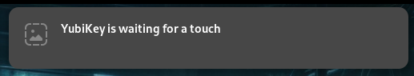

# YubiKey Touch Detector

Get notified when YubiKey needs a touch.

- [yubikey-touch-detector (github.com/maximbaz)](https://github.com/maximbaz/yubikey-touch-detector)



## Install

**Install deps and build Go binary:**

```shell
sudo dnf -y install gpgme-devel
git clone https://github.com/maximbaz/yubikey-touch-detector.git
cd yubikey-touch-detector
# go build
make
sudo make install
sudo cp ~/go/bin/yubikey-touch-detector /usr/bin/
```

**Copy systemd unit files and config into place:**

```shell
mkdir -p ~/.config/systemd/user
cp yubikey-touch-detector.{service,socket} ~/.config/systemd/user/
mkdir -p "${XDG_CONFIG_HOME:-"${HOME}/.config"}/yubikey-touch-detector"
cp service.conf.example "${XDG_CONFIG_HOME:-${HOME}/.config}/yubikey-touch-detector/service.conf"
```

## Configure

From the readme:

> The package also installs a systemd service and socket. If you want the app to launch on startup, just enable the service like so:

```shell
systemctl --user daemon-reload
systemctl --user enable --now yubikey-touch-detector.service
```

> If you want the service to be started only when there is a listener on Unix socket, enable the socket instead like so:

```shell
systemctl --user daemon-reload
systemctl --user enable --now yubikey-touch-detector.socket
```

*Note: I needed to add this to my ~/.bashrc for some unknown reason:*

```
systemctl restart --user yubikey-touch-detector.service
```
